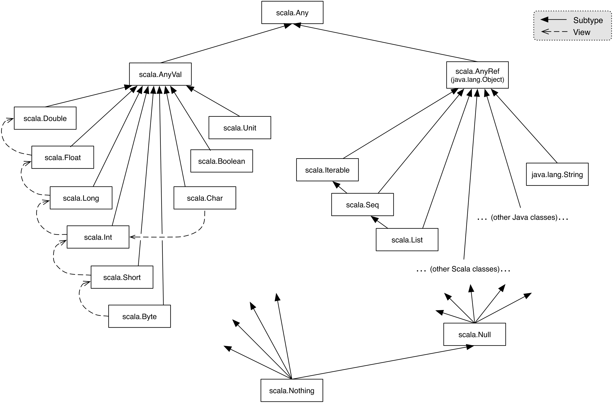

## 2023-11-27 - Scala, Variabili e costanti, Array, Liste, Funzioni e Lambda, Gerarchia, Classi, Case classes, Opzionali, Comprehensions

## Scala

Scala viene iniziato a sviluppare alla _Ècole Polytechnique Fédérale (EPFL)_ di Losanna, nel 2001. La prima release è del 2003, ed è _costantemente aggiornato_ (ultima release settembre 2023).

È stata recentemente rilasciata la **versione 3**, che presenta _significative modifiche_ al linguaggio, ancora _instabile_. Per questo motivo la versione utilizzata dal corso è **Scala2** _(2.13.x)_.

Scala gira sulla **JVM** e supporta l'utilizzo delle **librerie di Java**.

Caratteristiche:

- fusione tra **object-oriented** e **funzionale**
- sintassi **succinta**, **flessibile** ed **elegante** _(50%-75% riduzione di codice rispetto a Java)_
- interprete interattivo (**REPL**), supporta anche i file come script _(in stile python)_
- supporto per **domain specific languages** (DSL)
- staticamente tipizzato (**statically typed**)
- tipi di dati **astratti** e dipendenti dalla path (**path-dependent types**)
- classi **generiche**, attraverso la sintassi `Type[T]` (che corrisponde a `Type<T>` in Java)
- **metodi polimorfi**
- inferenza di tipo (**type inference**), _in forma limitata_, è sempre possibile specificare esplicitamente un tipo (alcune volte è necessario) attraverso la sintassi `variable: tipo`
- funzioni come **first-order** citizens

### Compilazione ed esecuzione

Scala ha un **REPL**, lanciabile dal comando `scala`, che accetta anche file script _("alla python", con codice fuori da classi)._

Il **compilatore** `scalac` accetta solo file validi, ovvero con tutte le istruzioni dentro classi.

La compilazione è **molto lenta** _(vengono effettuate decine di "passate")_, dato che devono venir risolte _tantissime possibili configurazioni_ diverse dovute alla _sintassi molto variabile_. Questo non intacca la **velocità di runtime**, dato che appunto viene tutto risolto a compilazione _(a differenza di python che delega quasi tutto a runtime)_.

### Variabili e Costanti

Le **variabili** sono definite attraverso la keyword `var`, mentre le **costanti** con `val`.

Le costanti funzionano in modo simile a molti altri linguaggi: è il "contenitore" ad essere costante, ma è possibile **variare il contenuto** _(è possibile modificare gli elementi di un array costante)_.

```scala
var num: Int = 4
num = 5 // mutated num
val pi: Double = 3.14
pi = 3 // error: reassignment to val
```

### Array, Liste e Parametri variabili (VarArgs)

Gli array e le liste sono delle **classi generiche**, il cui tipo viene definito tra `[]` (corrispettivo di `<>` in Java).

Gli array corrispondono agli _array_ di Java (**mutabili**, dimensione fissa), mentre le liste ad una _LinkedList_ (ma **immutabile**).

```scala
val a = new Array(3) // null,null,null
val a = new Array[Int](3) // 0,0,0
val a = new List(3) // error: list is abstract, cannot be instantiated

val arr = Array(1,2,3) // 1,2,3
val list = List(1,2,3) // 1,2,3

arr(1) = 0 // 1,0,3
list(1) = 0 // error: value update is not a member of List[Int]
```

La sintassi per definire una funzione che accetta un **numero variabile di parametri** (_varags_ su java, _variadic_ in go) è `nomeparametro: Tipo*`, verranno compressi in una sequenza (`ArraySeq`).

```scala
def test(nums: Int*) =
	println(nums)

test(1) // ArraySeq(1)
test(1,2,3,4) // ArraySeq(1,2,3,4)
```

### Funzioni e Lambda

È sempre necessario specificare il **tipo dei parametri**, mentre il tipo di ritorno può essere omesso. Le parentesi graffe sono necessarie solo quando il corpo è più lungo di una riga. Possono essere **parametriche**.

```scala
def function(a: Int, b: Int): Int = // non si usano le graffe
	a + b

def function(a: Int, b: Int) = // tipo di ritorno omesso
	a + b

def function(a: Int, b: Int) = { // si usano le graffe
	println(a)
	println(b)
	a + b
}

def function[T](a: T) = // funzione parametrica
	println(a)
```

Tutto è un **oggetto** ed ogni **operazione è un metodo** _(funzione associata ad una classe)_, quindi anche le operazioni basilari, come `2 + 1`, sono delle **chiamate di metodi** `2.+(1)`. È possibile _omettere_ sia il punto che le parentesi, su qualsiasi chiamata (dalle ultime versioni è necessario spuntare il flag `-language:postfixOps`):

```scala
2 + 1 // 3
2.+(1) // 3
"Ciao mondo".split(" ") // Array("Ciao", "mondo")
"Ciao mondo" split(" ") // Array("Ciao", "mondo")
"Ciao mondo" split " " // Array("Ciao", "mondo")
```

 In Scala sono presenti le **lambda** (funzioni anonime), che sono in realtà _associate_ ad una classe (che chiama il metodo `apply`).

 È possibile alleggerire notevolmente la sintassi delle lambda quando è presente un unico parametro, utilizzando la wildcard `_`:

```scala
val strings = List("ciao", "mondo")

strings.map((s: String) => s.toUpperCase())
strings.map((s: String) => s.toUpperCase) // rimosse () alla chiamata
strings.map((s) => s.toUpperCase) // rimosso tipo parametro
strings.map(s => s.toUpperCase) // rimosse parentesi per parametro
strings.map(_.toUpperCase) // utilizzata wildcard
strings.map(_ toUpperCase) // necessario compilare con flag -language:postfixOps

strings.map((s: String) => println(s))
strings.map(println(_)) // utilizzata wildcard
strings.map(println) // parametro inferito automaticamente
```

### Gerarchia, Classi, Case classes

La gerarchia delle classi di Scala ha come **radice** `Any`, che si divide in `AnyVal` per i tipi **primitivi** _(che non possono essere `null`)_ e `AnyRef` per tutti gli **oggetti** (equivalente di `Object` di Java).

È anche presente un **bottom** alla gerarchia, ovvero dei tipi che rappresentano il "**vuoto**", che sono compatibili con qualsiasi oggetto: `Null` per tutte le classi che estendono `AnyRef` (istanziato da `null`) e `Nothing` per tutti (non può essere istanziato).



Il **costruttore** di una classe è definito implicitamente nella firma della classe stessa _(è possibile effettuare overloading)_, mentre le funzioni definite all'interno di una classe sono i suoi **metodi**.

```scala
class Rational(n: Int, d: Int) extends AnyRef {
	val num = n
	val den = d

	// overloading costruttore
	def this(n: Int) =
		this(n, 1)

	def + (that: Rational): Rational =
		new Rational(num*that.den + that.num*den, den*that.den)

	def + (i: Int): Rational =
		new Rational(num + i*den, den)

	override def toString =
		"" + num + "/" + den
}
```

In Scala **non esistono metodi statici**, ma vengono utilizzate classi che possono essere istanziate una sola volta _(singleton)_, definite con la keyword `object`:

```scala
object Upper {
	def upper(strings: String*) = strings.map(_.toUpperCase())
}

println(Upper.upper("A", "First", "Scala", "Program"))
```

Esistono anche le case classes _(comparabili ai record di Java)_, ovvero **oggetti immutabili** che possono essere scomposti attraverso **pattern matching**.

```scala
abstract class Bool {
	def and(b: => Bool): Bool
	def or(b: => Bool): Bool
}

case object True extends Bool {
	def and(b: => Bool) = b
	def or(b: => Bool) = this
}

case object False extends Bool {
	def and(b: => Bool) = this
	def or(b: => Bool) = b
}
```

### Opzionali (Options)

Gli opzionali sono dei **wrapper** attorno ad oggetti che **potrebbero essere vuoti**. Contengono qualcosa (`Some(dato)`) o niente (`None`).

```scala
// getter di una mappa
def get[A, B](key: A): Option[B] = {
	if (contains(key)) new Some(getValue(key))
	else None
}

val Capitals = Map(
	"Piemonte" -> "Torino",
	"Liguria" -> "Genova",
	"Lombardia" -> "Milano",
	// ...
)

Capitals.get("Lombardia") // Some(Milano)
Capitals.get("Padania") // None
Capitals.get("Liguria").get // Genova
Capitals.get("Lombardia").getOrElse("404") // Milano
Capitals.get("Padania").getOrElse("404") // 404
```

### Comprehensions e Generatori

Le comprehensions sono dei meccanismi per **attraversare** un insieme di qualcosa, "comprendere" il suo contenuto e **computare** qualcosa di nuovo da esso.

```scala
def sum_evens =
	(L: List[Int]) => {
		var sum = 0;
		for (X <- L if X%2 == 0)
			sum += X;
		sum
	}
```

È possibile ottenere una **nuova collezione** da una comprehensions attraverso la parola chiave `yield`.

```scala
val is_prime = (X: Int) => {
	val divisors = (X: Int) =>
		for {Y <- List.range(2, math.sqrt(X).toInt) if (X % Y == 0)}
			yield Y
	divisors(X).length == 0
}
```
